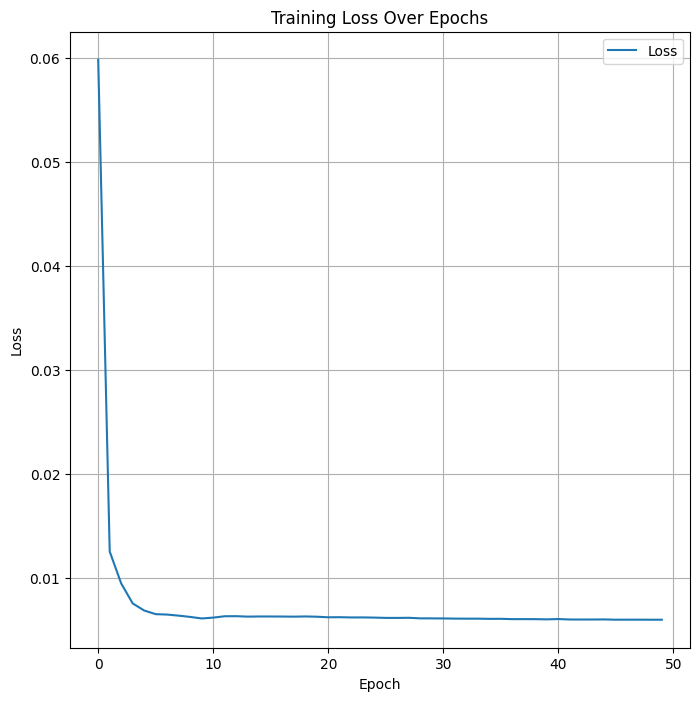
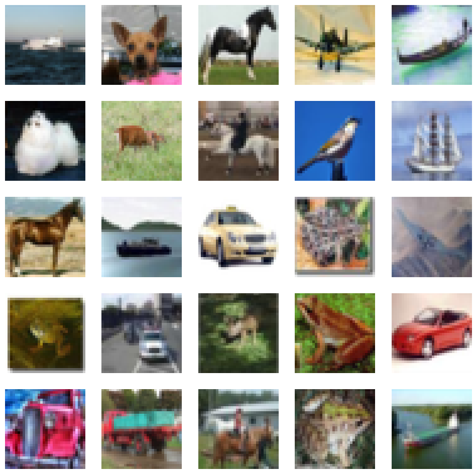
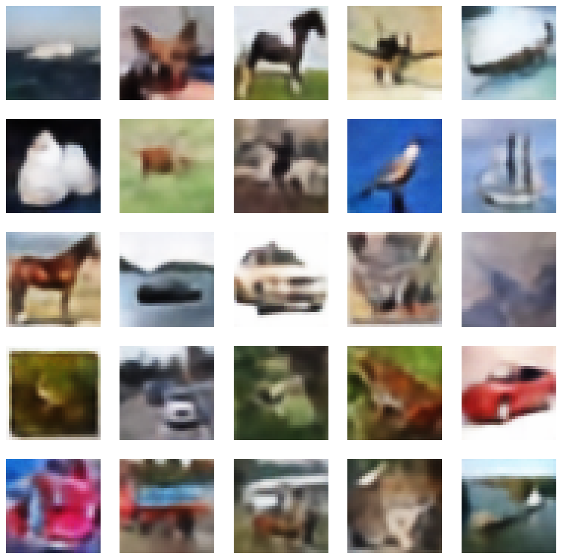

# VQ-VAE: Vector Quantized Variational Autoencoder

## Overview
This is an implementation of a Vector Quantized Variational Autoencoder (VQ-VAE) using pytorch. The model uses the CIFAR-10 dataset for training.

## Prerequisites
- Python 3.x
- CUDA device (recommended)

## Installation
1. Clone this repository to your local machine
2. Install the required dependencies using pip:
    ```
    pip install -r requirements.txt
    ```

## Training
To train the model, run:
```
python main.py
```
This script will load the CIFAR-10 dataset, train the VQ-VAE model, and save the model.

## Results
### Training Loss Curve
<p align='center'>

</p>

### Original vs Reconstruction

#### Original
<p align='center'>

</p>

#### Reconstruction
<p align='center'>

</p>

## Reference
[Neural Discrete Representation Learning](https://arxiv.org/abs/1711.00937) by Aaron van den Oord, Oriol Vinyals & Koray Kavukcuoglu
